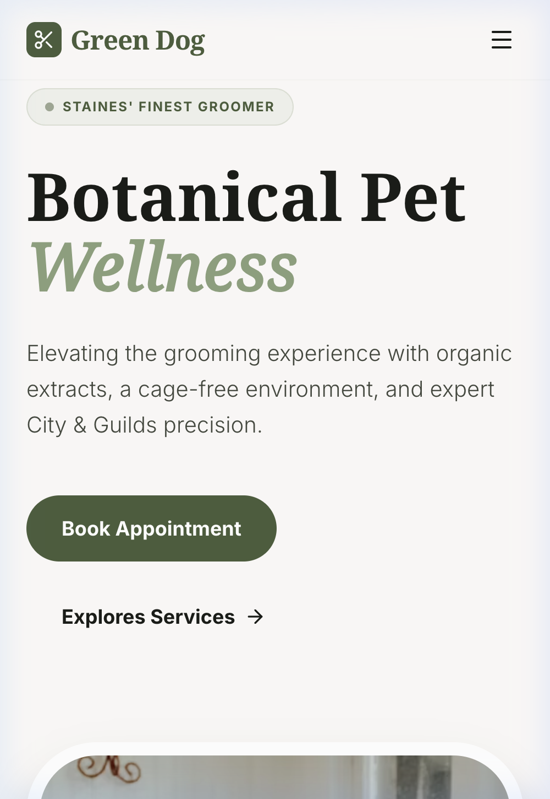

# 🌿 Green Dog Grooming: Botanical Pet Wellness

A premium, artisan digital transformation for **Green Dog Grooming** (Staines-upon-Thames based salon). This React-based application features a high-end "Botanical Pet Wellness" aesthetic, an intelligent booking engine, and a private groomer portal.



## ✨ Premium Features

### 📐 Multi-Page Architecture
- **Home**: Immersive storytelling with a "No Cages" value proposition.
- **Services**: Detailed treatment matrix (Full Groom, Puppy Intro, etc.).
- **Gallery**: Professional transformation grid with an interactive **Before & After Slider**.
- **The Salon**: Fiona's professional story and botanical philosophy.
- **Contact**: Specialized inquiry form with breed-specific fields.

### ⚙️ Specialized Tools
- **Intelligent Booking Engine**: 3-step calibrated flow for breed-size pricing.
- **Pet Wellness Dashboard**: Digital health reports and grooming history for owners.
- **Internal Salon Roster**: Private hub for managing daily appointments and salon stats.


## 🛠 Tech Stack
- **Framework**: React 19 (Vite) + TypeScript
- **Styling**: Tailwind CSS (v4)
- **Animations**: Framer Motion
- **Icons**: Lucide React
- **Routing**: React Router Dom

## 🚀 Getting Started

### Prerequisites
- Node.js (v18 or higher)

### Installation
1. Clone the repository:
   ```bash
   git clone https://github.com/scalaritsolutions/GreenDog.git
   ```
2. Install dependencies:
   ```bash
   npm install
   ```
3. Start the development server:
   ```bash
   npm run dev
   ```

## 🔐 Internal Access
To access the private groomer roster, navigate to the `/internal` route or click the "Internal Portal" link in the footer.

---
*Created with the help of Antigravity AI.*
